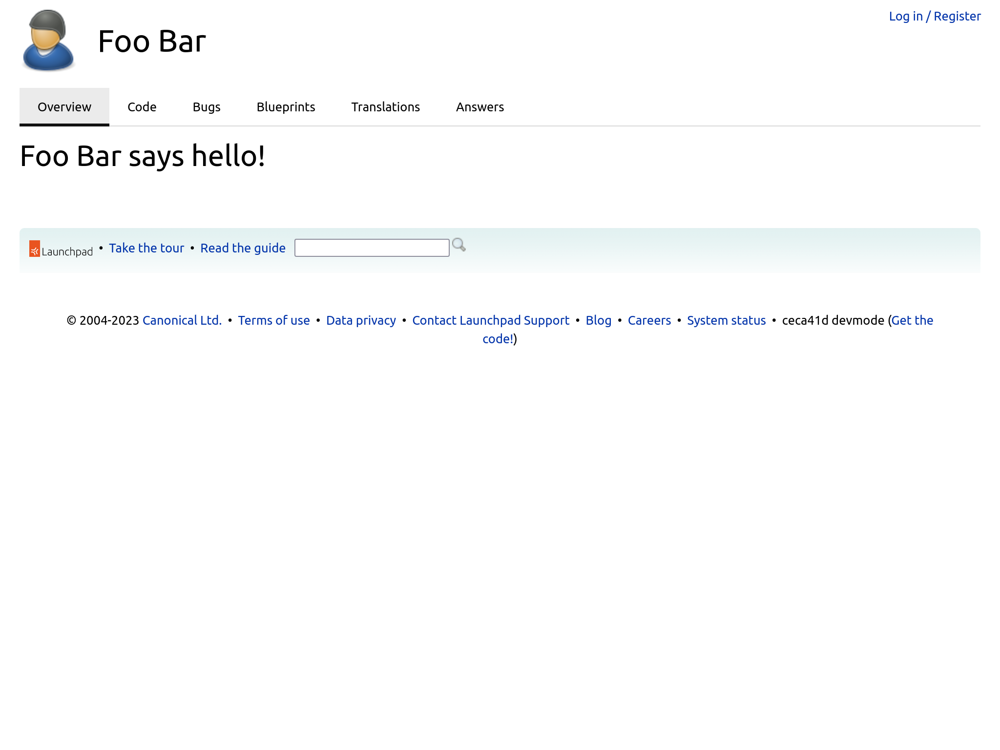

================================
Creating a new page in Launchpad
================================

In this tutorial, we will be creating a new page in Launchpad that shows a
greeting from a specific user. This will be available at ``/~username/+hello``.

Pre-requisites
==============

You have the :doc:`Launchpad development environment set up <../how-to/running>`.

Introduction
============

A page in Launchpad requires a view class, an interface it is related to,
and a page template to render the HTML. These are then mapped to a page
at a specific URL using a ZCML directive. Let us learn how to do this in
the following sections.

Identifying the interface
=========================

Since the page should show a greeting from a user, the context should be the
user. In Launchpad, a user is represented by the ``IPerson`` interface, which
is defined in ``lib/lp/registry/interfaces/person.py``.

Creating a view class
=====================

The view classes are implemented in the ``browser/`` subdirectory of a package
in Launchpad. Since this view is providing functionality related to the Registry
application in Launchpad (the ``IPerson`` interface is defined there), we will
be adding this view class in that package.

Open ``lib/lp/registry/browser/person.py`` and add the following view class at
the end of the file.

.. code-block:: python

    class PersonHelloView(LaunchpadView):
        """View used to show a hello message from an IPerson."""

        @property
        def label(self):
            return "{} says hello!".format(self.context.displayname)

        page_title = label

This view inherits from the ``LaunchpadView`` class that provides a lot of
the functionality needed by a Launchpad page. Here, we have created a property
named ``label`` and assigned its value to the ``page_title`` attribute of the
class.

Creating the page template
==========================

We need a page template to render the data provided by the view class as HTML.
So create a file named ``person-hello.pt`` in the ``lib/lp/registry/templates``
directory and add the following contents.

.. code-block:: html

    <html
      xmlns="http://www.w3.org/1999/xhtml"
      xmlns:tal="http://xml.zope.org/namespaces/tal"
      xmlns:metal="http://xml.zope.org/namespaces/metal"
      xmlns:i18n="http://xml.zope.org/namespaces/i18n"
      xml:lang="en"
      lang="en"
      dir="ltr"
      metal:use-macro="view/macro:page/main_only"
      i18n:domain="launchpad"
    >
    </html>

The ``metal:use-macro`` attribute, with ``view/macro:page/main_only`` as its
value, renders a base template of Launchpad with a specific layout. The base
template has code to render the view's ``label`` attribute as a heading. It
also renders the page's title using the view's ``page_title`` attribute.
With this, we get a page that looks like many of the existing pages in
Launchpad, without having to write any other HTML or page template code.

Connecting the view, the interface, and the template
====================================================

Now we have to configure Launchpad to serve this page. To do so, add the
following ZCML directive to ``lib/lp/registry/browser/configure.zcml``, above
the ``<browser:pages>`` directive for the ``IPerson`` interface and the
``lp.registry.browser.person.PersonView`` view class.

.. code-block:: xml

    <browser:page
      for="lp.registry.interfaces.person.IPerson"
      class="lp.registry.browser.person.PersonHelloView"
      name="+hello"
      permission="zope.Public"
      template="../templates/person-hello.pt"
    />

This specifies that there is a new browser page for the ``IPerson`` interface,
using the ``PersonHelloView`` view class and the ``person-hello.pt`` page
template. The permission, ``zope.Public``, allows the page to be viewed
by everyone who can view the user. The value of the ``name`` attribute,
``+hello``, specifies the path at which this page can be accessed, relative to
the URL of the ``IPerson`` interface. So if the URL for an ``IPerson`` page is
``/~username``, this page should be available at ``/~username/+hello``.

Viewing the page in the browser
===============================
Navigate to the top-level directory of the Launchpad repository inside the
Launchpad LXC container. Run ``make run`` to start the development server and wait
for it to finish loading.

Open the browser and navigate to `<https://launchpad.test/~name16/+hello>`_. Here,
``name16`` is a well-known, existing user in the Launchpad development database.
Once the page loads, you can see that it is a typical Launchpad site page and
that the ``Overview`` tab is active. You can also see a heading that says
``Foo Bar says hello!`` heading below the tab bar.

